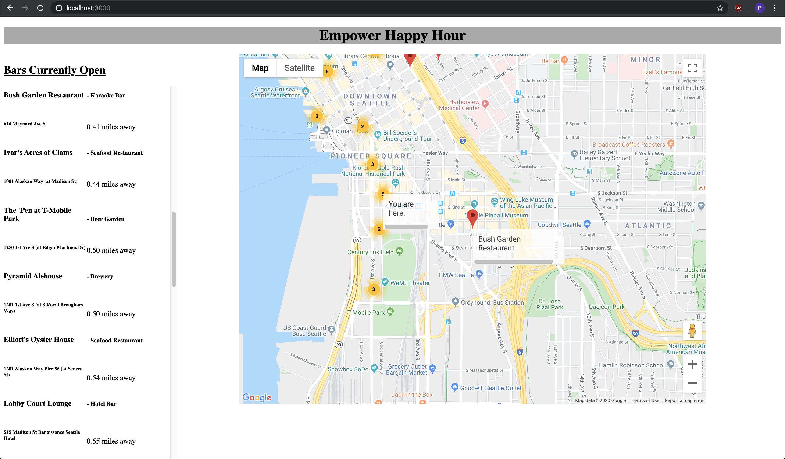

# Empower-Happy-Hour

> A map based MVP of a search app returning results of affordable bars nearby

## Screenshot



## Usage

```bash
# Install dependencies
$ npm install

# Bundle files with webpack in development mode
$ npm run build

# Run the app
$ npm run start
```

## Requirements

- [npm](http://npmjs.com)
- [Node.js](https://nodejs.org/en/download/)
- [Git](https://git-scm.com)
